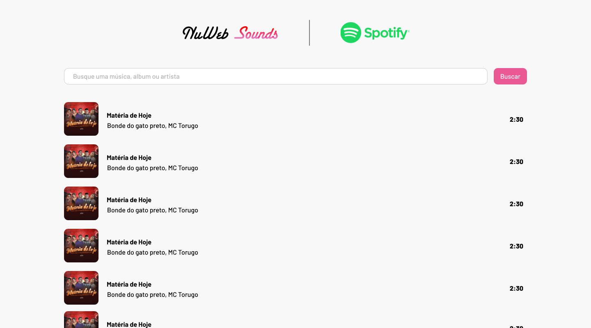

# 💻 NuWeb - Bolsistas

Parabéns por ser selecionado!

Esperamos que tenha um ótimo desempenho no teste e venha junto com o time construir esses projetos incríveis!
 

## O que esperamos? 🤨

O objetivo principal deste desafio é avaliar sua capacidade de construir uma interfarce utilizando ferramentas semelhantes às que usamos aqui nos projetos da NuWeb
 

#### As tecnologias que devem constar no projeto são:

- [HTML](https://developer.mozilla.org/pt-BR/docs/Web/HTML)
- [JAVASCRIPT](https://developer.mozilla.org/pt-BR/docs/Web/JavaScript)
- [CSS](https://developer.mozilla.org/pt-BR/docs/Web/CSS)

 

#### Além dos requisitos citados acima, vamos avaliar os seguintes pontos:

- Estrutura Limpa
- Usabilidade
- Performance
 

## Sobre o desafio 🤯

O Objetivo será implementar uma interface de listagem de músicas.

Para isso será utilizado o arquivo JSON para requisitar os dados necessários.

O projeto deverá ser entregue em forma de repositório público com as instruções de instalação e execução.
 

## Direcionamento 😇

 

**Importante!** A API será disponibilizada depois.
 

#### Você pode seguir design acima ou não:

- Header com logos da NuWeb Sounds e Spotify
- Input para pesquisa de músicas (quando em branco deve voltar para a listagem principal)
- Listagem
 

## Diferenciais que podem agradar:

Fique à vontade para adicionar novas funcionalidades, por exemplo player funcional com preview de 30 segundos da música ou incrementar no design e usabilidade da view.
 

## Entrega:

Dia: 28/06/2021 às 23:59
 
